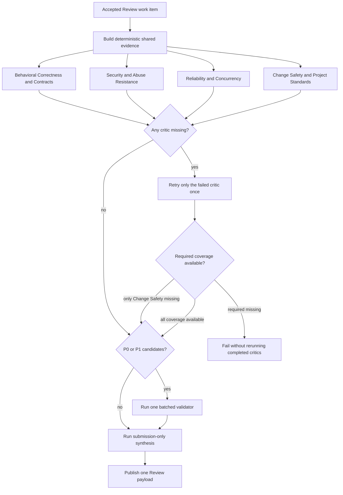
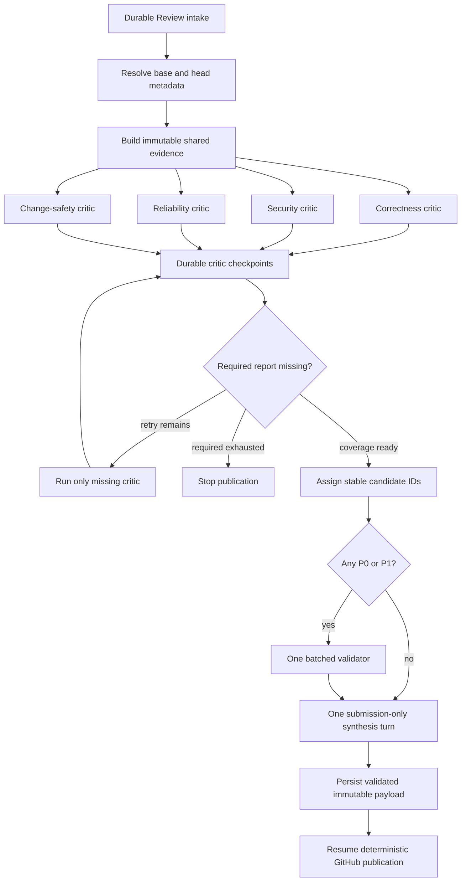
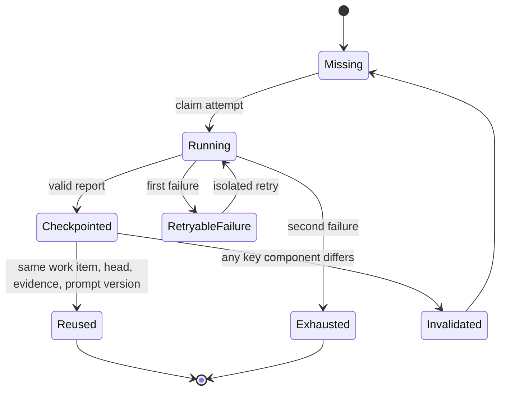
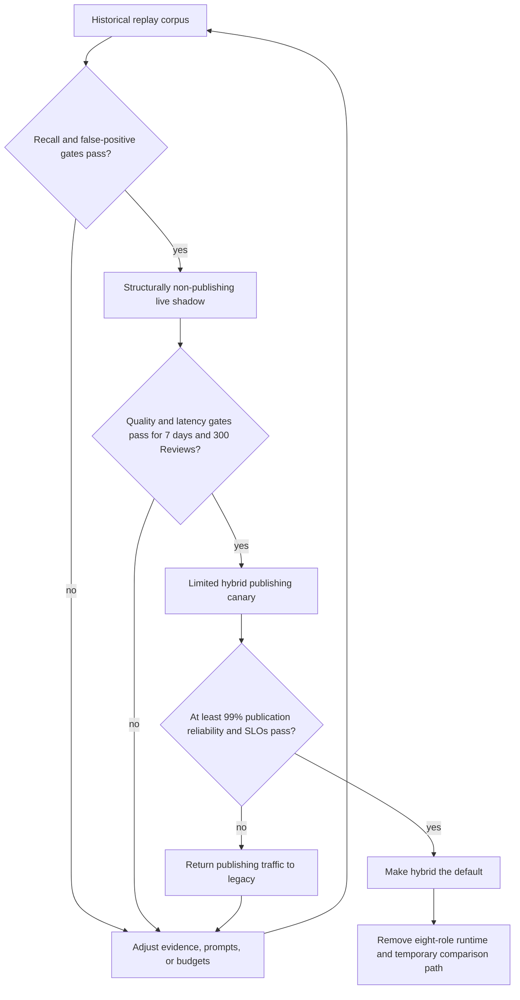

# Fast Hybrid Review - Plan

## Goal Capsule

- **Objective:** Restore comprehensive Review completion to a median of at most three minutes and a p95 of at most five minutes without reducing valid P0-P2 bug recall or increasing false positives.
- **Product authority:** This Product Contract defines the required Review behavior, coverage policy, quality gates, latency targets, and scope boundaries.
- **Open blockers:** None. The Planning Contract resolves evidence representation, tool budgets, validator semantics, and rollout sample sizes.
- **Execution profile:** Refactor the Review pipeline in dependency order, preserve the existing public Review surface, and hold the default cutover behind replay, shadow, and canary gates.
- **Authority order:** Product Contract, Planning Contract decisions, Implementation Units, then repository conventions and implementation judgment.
- **Stop conditions:** Stop before default cutover if comprehensive changed-path coverage cannot be proven, a required critic cannot complete after its one retry, or replay/shadow quality regresses.
- **Tail ownership:** Implementation owns code, migrations, tests, documentation, and rollout instrumentation; operators own the observation window and explicit default-mode cutover after the recorded gates pass.

---

## Product Contract

### Summary

Replace repeated full-PR investigation with deterministic shared evidence and four parallel Reviewer critics covering behavior, security, reliability, and change safety. Finish with one investigation-tool-free, submission-only synthesis call and, only when needed, one batched P0/P1 validator.

### Problem Frame

The unified multi-agent Review pipeline increased elapsed time from the previous two-to-three-minute range to six-to-ten minutes in normal use. Limiting the Reviewer roster by PR size reduced provider load but did not remove the slowest-Reviewer critical path, repeated repository exploration, validation cost, or heavyweight synthesis.

The supplied production logs contain 23 Review job attempts and only seven published attempts. Published attempts spent roughly 179-385 seconds in the Reviewer ensemble, followed by roughly 71-243 seconds outside the recorded database, preflight, ensemble, and validation spans. The deployed worker also allowed 24 tool rounds for Reviewers, validators, and the orchestrator, while the documented defaults are 16, 8, and 8.

The existing eight Reviewer agents share the same tools, report schema, user content, and general evidence contract. Their main differentiation is a short role-specific guidance block, so adding roles multiplies broad autonomous investigation more than it creates narrowly partitioned work.

### Key Decisions

- **Four domain critics replace the eight-role roster.** Every full Review runs Behavioral Correctness and Contracts, Security and Abuse Resistance, Reliability and Concurrency, and Change Safety and Project Standards in one parallel wave.
- **Tests and adversarial analysis become cross-cutting methods.** Every critic must attempt to falsify the change and identify consequential testing gaps within its domain.
- **Shared evidence is deterministic.** The Review run prepares evidence from the changed-file set, diff context, repository contracts, and reusable read results without creating a fifth investigation agent.
- **Critic exploration is bounded.** Critics may use targeted read-only follow-ups when shared evidence is insufficient, but cannot restart an unrestricted full-repository sweep.
- **Fan-in is intentionally small.** One investigation-tool-free, submission-only synthesis call merges the reports; one batched validator runs only when P0/P1 candidates exist.
- **Retries preserve completed work.** A failed critic receives one isolated retry while shared evidence and successful reports remain available.
- **Coverage outranks latency for outliers.** Large or truncated change sets retain comprehensive coverage and may be marked exempt from the normal latency SLO.

### Actors

- A1. **PR maintainer or author:** Receives one timely, trustworthy Review payload with clear coverage and findings.
- A2. **Shared-evidence stage:** Produces one trusted view of the changed surface and applicable repository context.
- A3. **Reviewer critics:** Independently reason over assigned risk domains using the shared evidence and bounded follow-ups.
- A4. **Validator and synthesizer:** Validate high-risk candidates when present, merge supported reports, and produce one final Review payload without rediscovering the PR.

### Review Flow



### Key Flows

- F1. **Normal Review**
  - **Trigger:** An eligible automated or slash-command Review begins on a supported, non-truncated change set.
  - **Actors:** A2, A3, A4.
  - **Steps:** Build shared evidence, run all four critics in parallel, validate P0/P1 candidates as one batch when present, synthesize once, and publish.
  - **Outcome:** The Review finishes within the normal latency target without repeated broad investigation.

- F2. **Critic failure**
  - **Trigger:** One critic does not return a valid report.
  - **Actors:** A3, A4.
  - **Steps:** Preserve completed reports and shared evidence, retry only the failed critic once, then apply the required-coverage policy.
  - **Outcome:** Correctness, Security, or Reliability failure blocks publication; Change Safety failure permits an explicitly degraded Review.

- F3. **Large or truncated Review**
  - **Trigger:** The changed-file set is large or truncated under the repository's Review budget classification.
  - **Actors:** A2, A3, A4.
  - **Steps:** Retain all four critics and comprehensive coverage while recording that the run is exempt from the normal latency SLO.
  - **Outcome:** The system does not silently trade away coverage to meet the common-case speed target.

### Requirements

**Reviewer coverage**

- R1. Every full Review must run exactly four Reviewer critics in one parallel wave, independent of PR size.
- R2. The four critics must be Behavioral Correctness and Contracts, Security and Abuse Resistance, Reliability and Concurrency, and Change Safety and Project Standards.
- R3. Behavioral Correctness and Contracts must own reachable functional defects, state and control-flow errors, caller compatibility, schemas, serialization, and API contracts.
- R4. Security and Abuse Resistance must own trust boundaries, authorization, injection, secret exposure, privileged operations, hostile inputs, and security-specific resource abuse.
- R5. Reliability and Concurrency must own retries, idempotency, cancellation, superseding, timeouts, queues, races, ordering, partial failure, cleanup, and measurable performance regressions.
- R6. Change Safety and Project Standards must own structural defects affecting safe evolution, applicable repository instructions, documented contracts, configuration consistency, and prose-contract contradictions while excluding taste-only findings.
- R7. Every critic must attempt adversarial falsification and report consequential testing gaps for its own domain.

**Shared evidence and investigation**

- R8. The Review run must build one deterministic evidence packet covering every changed file, available diff context, applicable repository contracts, and known change-set limitations.
- R9. Shared evidence must not require an additional investigation agent.
- R10. Critics must begin from shared evidence and may perform only bounded, targeted read-only follow-ups needed to confirm coverage or a candidate finding.
- R11. Every critic report must identify covered areas, supported findings, residual risks, testing gaps, and any evidence it could not obtain.

**Validation, synthesis, and publication**

- R12. P0/P1 candidates must be validated in one batched validator session when at least one such candidate exists; Reviews without P0/P1 candidates must skip the validator stage.
- R13. A validator failure or unverifiable candidate must fail open by preserving the candidate as unvalidated context rather than silently removing it.
- R14. Final synthesis must use one investigation-tool-free, submission-only, single-turn model call that may merge, deduplicate, reject, and summarize submitted findings but may not inspect the repository or originate new findings.
- R15. The pipeline must continue to publish at most one public Review payload per Review run through the existing Review publication surface.

**Failure and retry behavior**

- R16. Behavioral Correctness and Contracts, Security and Abuse Resistance, and Reliability and Concurrency are required coverage.
- R17. Change Safety and Project Standards may be omitted from final synthesis only after its isolated retry fails, and the Review must identify the resulting degraded coverage.
- R18. A failed critic must receive at most one isolated retry without rerunning successful critics, rebuilding unchanged evidence, or discarding valid reports.
- R19. A required critic that remains unavailable after its isolated retry must stop publication through the normal Review failure path.

**Performance and rollout**

- R20. Eligible, non-cancelled, non-SLO-exempt Reviews must reach a median elapsed time of at most three minutes and a p95 of at most five minutes from webhook acceptance to published Review.
- R21. At least 99% of eligible, non-cancelled Reviews must publish successfully without manual retry.
- R22. Large or truncated Reviews may exceed the latency target to preserve comprehensive coverage and must be recorded as SLO-exempt rather than counted as ordinary latency failures.
- R23. The replacement pipeline must not require changing the configured agent provider or model as its primary speed mechanism.
- R24. The replacement must show no regression in valid P0-P2 recall or false-positive rate under historical PR replay and live shadow comparison before it becomes the default.

### Acceptance Examples

- AE1. **Covers R1, R8, R14, R20.** Given a normal PR with no P0/P1 candidates, when a Review runs, then the system builds evidence once, runs four critics in one wave, skips validation, performs one investigation-tool-free, submission-only synthesis call, and publishes within the normal latency target.
- AE2. **Covers R12-R14.** Given several P0/P1 candidates across multiple critic reports, when validation begins, then one validator session checks the candidate batch and preserves any unverifiable candidates as unvalidated context before synthesis.
- AE3. **Covers R16-R19.** Given Reliability fails while the other critics succeed, when its isolated retry also fails, then the Review fails without rerunning the completed critics.
- AE4. **Covers R17-R18.** Given Change Safety fails while the required critics succeed, when its isolated retry also fails, then the Review publishes with degraded coverage using the preserved reports.
- AE5. **Covers R18.** Given a critic fails after other reports completed, when the retry starts, then the shared evidence and successful reports are reused rather than recreated.
- AE6. **Covers R22.** Given a large or truncated change set, when comprehensive investigation exceeds five minutes, then the run remains valid and is classified as SLO-exempt.

### Success Criteria

- Median webhook-to-publication latency is at most three minutes for eligible, non-exempt Reviews.
- p95 webhook-to-publication latency is at most five minutes for eligible, non-exempt Reviews.
- At least 99% of eligible, non-cancelled Reviews publish without manual retry.
- Historical replay and live shadow evaluation show no regression in valid P0-P2 recall or false-positive rate.
- Reviewer failures never cause already-completed critics to run again within the same Review work item.
- The synthesis stage performs no repository investigation and contributes a bounded minority of total wall time.

### Scope Boundaries

**In scope**

- Full automated and slash-command Review runs.
- Shared evidence preparation, four-critic fan-out, critic retry behavior, high-risk validation, synthesis, stage metrics, and rollout quality gates.
- Review-specific configuration needed to enforce the agreed behavior and targets.

**Out of scope**

- Changing the provider or model as the primary optimization.
- Redesigning Ask, Description, Triage, Verification, or Lightweight review completion.
- Changing the public Review identity or creating additional public Review payloads.
- Partitioning one PR into more than four Reviewer critic sessions to meet latency targets.

### Dependencies and Assumptions

- The existing local PR workspace, cached diff metadata, and repository policy context can supply the deterministic evidence baseline.
- Critics can request bounded follow-up evidence without receiving unrestricted investigation budgets.
- Historical PRs with known valid findings can be assembled into a representative replay corpus.
- Shadow execution can compare pipelines without producing duplicate public GitHub output.
- Planning will add enough stage-level observability to distinguish evidence preparation, each critic, retry, validation, synthesis, and publication time.

### Planning Inputs

**Resolved in Planning Contract > Resolved During Planning**

- What exact evidence packet shape gives critics sufficient context without recreating large duplicated prompts?
- What follow-up tool and time budgets satisfy the quality and latency gates for each critic?
- How should batched validation express per-candidate verdicts within the fail-open policy?
- What historical corpus size, shadow duration, and statistical tolerance are sufficient for the no-regression launch gate?

### Sources and Research

- `CONTEXT.md` for canonical Review, Reviewer agent, Review orchestrator, Review synthesis, and degraded review vocabulary.
- `docs/adr/0022-unified-multi-agent-review.md` for the current unified Review architecture and ephemeral Reviewer reports.
- `docs/adr/0023-review-budget-tier-roster.md` for the roster-limiting attempt and synthesis-only intent.
- `docs/configuration.md` for current Review concurrency and tool-round defaults; the 16/8/8 reviewer/validator/orchestrator defaults are `DEFAULT_MAX_TOOL_ROUNDS_REVIEWER`, `DEFAULT_MAX_TOOL_ROUNDS_VALIDATOR`, and `DEFAULT_MAX_TOOL_ROUNDS_ORCHESTRATOR` in `src/settings/defaults.ts` (lines 12-14 at `base_commit`).
- `src/review/prompts/reviewerPrompt.ts` for the eight role prompts, shared contracts, and delegated core coverage; `REVIEWER_IDS` (lines 5-14 at `base_commit`) lists `correctness`, `security`, `tests`, `maintainability`, `project-standards`, `reliability`, `api-contracts`, `adversarial`.
- `src/review/run/reviewEnsemble.ts` for the shared report contract, isolated Reviewer sessions, and the per-candidate validator fan-out this plan replaces (one validator session per candidate around lines 259-303 at `base_commit`).
- `src/review/run/reviewRun.ts` for current stage ordering and orchestrator behavior.
- `src/review/run/reviewRunMetrics.ts` for existing Review timing and session-role metrics.
- `migrations/001_agent_work.sql` for `webhook_events.received_at` and the `work_items.webhook_event_id` FK (`ON DELETE SET NULL`) that KTD9's latency measurement depends on.
- Supplied worker and web runtime log captures dated 2026-07-13 for observed latency, completion, tool-budget, and role-failure evidence.

If any of these anchors no longer matches the code at implementation time, the codebase has drifted since `base_commit`; re-verify the affected unit's approach against the live code before proceeding.

---

## Planning Contract

### Product Contract Preservation

Product Contract changed: R14 and related synthesis wording clarify that “tool-free” excludes investigation tools while retaining the structured submission capability; the planning-input heading now points to its resolutions below. Product scope is unchanged, and R1-R24, A1-A4, F1-F3, and AE1-AE6 retain their original intent and stable IDs.

### Resolved During Planning

- **Evidence packet:** Use one immutable, versioned snapshot keyed by work item, base SHA, head SHA, and a deterministic evidence hash. It contains the authoritative changed-path inventory, bounded per-path diff context, omission markers, applicable repository contracts, prior inline feedback, repo policy, and explicit coverage gaps.
- **Critic follow-ups:** Give each critic at most four provider-neutral tool rounds and at most three successful investigation tool calls. Allow only focused workspace reads, literal search, and per-path diff retrieval; the submit capability does not consume the investigation-call budget.
- **Validation contract:** Send P0/P1 candidates in one compact stable-ID batch. The validator returns `confirmed`, `refuted`, or `unverifiable` for each candidate; only `refuted` candidates are removed, and missing, malformed, or context-limited verdicts become `unverifiable` without disappearing from synthesis.
- **Replay corpus:** Require at least 50 adjudicated historical PRs, stratified across size tiers and the four critic domains, including known P0-P2 findings and clean controls.
- **Live rollout:** Require at least seven days and 300 eligible paired shadow Reviews, whichever is later, followed by a limited publishing canary. Default cutover requires the latency, publication-reliability, recall, and false-positive gates below.

### Key Technical Decisions

- KTD1. **Evidence is a server-owned snapshot, not agent memory.** Build it once before fan-out, serialize it canonically, and hash it so every critic, retry, validator, and synthesis attempt can prove it reasoned over the same PR state.
- KTD2. **The complete GitHub file-list path remains the common-case fast path.** When the listing is truncated or configured patch caps omit diff context, fetch the base ref, verify the advertised base SHA, deepen history until the merge base is available within existing workspace safety caps, and derive the authoritative three-dot path set and diffs from git. A run that cannot establish this authoritative set fails coverage rather than publishing a partial Review.
- KTD3. **The four critic IDs are fixed internal contracts:** `correctness`, `security`, `reliability`, and `change-safety`. Review budget tier continues to steer focus and SLO classification but never selects or omits critics. Three of these IDs collide with legacy eight-role IDs while both pipelines coexist, so every metric, PostHog property, and session-role record must carry the pipeline mode alongside the critic ID; checkpoints are already disambiguated by prompt-contract version.
- KTD4. **Tools enforce bounded exploration at the server boundary.** Prompt instructions explain the remit, while the runtime allowlist and counters prevent broad listing, blame, Context7 lookup, or unrestricted repeated searches from recreating the former autonomous sweeps.
- KTD5. **Critic progress is durable within one work item.** Persist successful reports and attempt counts using work item, head SHA, evidence hash, critic ID, and prompt-contract version. A pg-boss retry reuses only an exact match and never reuses artifacts from a stale-head replacement work item.
- KTD6. **All active Review sessions share one cancellation registry.** Superseding or cancellation aborts the evidence/critic pipeline, explicitly cancels every registered critic, validator, and synthesis session, and prevents a captured payload from publishing afterward.
- KTD7. **Validation is one semantic batch.** Assign stable candidate IDs before the validator call, preserve provenance to critic and finding index, and interpret absent or invalid verdicts as `unverifiable` so validation can reduce false positives without becoming a silent deletion path.
- KTD8. **Synthesis and publication are separate phases.** The synthesis session receives validated reports and a single structured `submitReview` handoff but no investigation tools. The server normalizes and validates the captured Review payload, persists it as immutable publish state, then resumes GitHub mutations deterministically through existing publish records without another model turn.
- KTD9. **Latency starts at durable intake.** Compute webhook-to-publication latency from the associated webhook delivery's persisted receipt time, falling back to work-item creation when no delivery timestamp exists. The fallback is a normal path, not an edge case: `work_items.webhook_event_id` is `ON DELETE SET NULL` (`migrations/001_agent_work.sql`), so retention can null the linkage on long-lived work. Retain work-item creation and executor startup as separate diagnostics, and record SLO-exempt reasons independently from successful publication.
- KTD10. **Shadow mode cannot publish by construction.** The evaluation path receives a payload sink and metrics recorder but no GitHub publication executor or token-bearing `submitReview` implementation. A sampled shadow may run beside the publishing legacy pipeline during rollout, with its extra provider pressure reported explicitly.
- KTD11. **Cutover is reversible.** Introduce `legacy`, `shadow`, and `hybrid` pipeline modes for rollout; keep the legacy implementation only until replay, shadow, and canary gates pass, then remove the eight-role runtime and temporary comparison path in the final cleanup phase.

### High-Level Technical Design

#### Review data flow



#### Durable critic lifecycle



#### Rollout decision flow



### Output Structure

```text
src/review/evaluation/
├── reviewComparison.ts
├── reviewReplay.ts
└── reviewShadow.ts

test/fixtures/review-replay/
├── manifest.json
└── <adjudicated-case fixtures>
```

### Sequencing

1. Establish authoritative evidence and durable artifact contracts before changing agent orchestration.
2. Replace the roster and retry behavior before changing validation and synthesis, so failures remain attributable.
3. Separate synthesis from publication before measuring end-to-end latency and reliability.
4. Add replay and shadow evaluation while the legacy pipeline still exists as a comparison baseline.
5. Cut over only after the recorded gates pass, then remove the temporary legacy and comparison runtime.

### Deferred Implementation Notes

- Exact helper names and module splits may change if existing files provide a clearer seam; the evidence, checkpoint, and publication contracts are fixed.
- Progressive git deepening should reuse existing fetch timeout, disk, and byte protections. The exact increment schedule is an implementation-time choice as long as merge-base failure is explicit and covered.
- Replay fixture storage may keep large diffs outside git when repository size makes committed fixtures impractical, but the manifest schema and adjudicated expected outcomes must remain versioned.

---

## Implementation Units

### U1. Build authoritative shared Review evidence

- **Goal:** Produce one immutable evidence snapshot that covers every changed path and supplies bounded, explicit context to all downstream stages.
- **Requirements:** R8-R11, R22; A2; F1, F3; AE1, AE6; KTD1, KTD2.
- **Dependencies:** None.
- **Files:** `src/agentWork/githubPrSurface.ts`, `src/github/listPullRequestFiles.ts`, `src/prWorkspace/localPrWorkspace.ts`, `src/prWorkspace/prRepositoryView.ts`, `src/review/placement/reviewPreflightFiles.ts`, `src/review/placement/reviewDiffIndex.ts`, `src/review/prompts/reviewTrustedContext.ts`, `src/review/run/reviewEvidence.ts` (new), `src/review/run/reviewRunTypes.ts`, `test/listPullRequestFiles.test.ts`, `test/localPrWorkspace.test.ts`, `test/prRepositoryView.test.ts`, `test/reviewDiffIndex.test.ts`, `test/reviewEvidence.test.ts` (new).
- **Approach:** Extend pull metadata with base SHA and base ref. Preserve the existing GitHub-list fast path when it is complete, but switch to verified three-dot git derivation when paths or patches are omitted. Build a canonical snapshot containing identity/version fields, full changed-path metadata, bounded diffs, omission reasons, applicable instruction/policy context, prior feedback, and coverage gaps. Compute the evidence hash only after the snapshot is final.
- **Patterns to follow:** Head-SHA validation in `src/github/listPullRequestFiles.ts`; checkout safety and fetch caps in `src/prWorkspace/localPrWorkspace.ts`; server-owned trusted context in `src/review/prompts/reviewTrustedContext.ts`; deterministic diff ingestion in `src/review/placement/reviewDiffIndex.ts`.
- **Test scenarios:**
  1. Covers F1 / AE1. Given a complete non-truncated file listing with patches under the cap, evidence uses the GitHub fast path, contains every listed file once, and records no coverage gap.
  2. Covers F3 / AE6. Given a truncated listing, workspace preparation fetches and verifies base/head history, derives the complete three-dot path set, marks the Review SLO-exempt, and exposes every derived path to evidence and diff placement.
  3. Given a complete file listing whose patch budget omits later patches, evidence reconstructs those per-path diffs from git without changing the authoritative path count.
  4. Given renamed, deleted, binary, and whitespace-only files, evidence preserves status and omission semantics without attempting to read deleted paths as head files.
  5. Given base ref movement during fetch, the fetched base must match the advertised base SHA or evidence preparation retries/fails without mixing commits.
  6. Given history that cannot reach a merge base before existing fetch safety limits, the Review fails coverage and does not label a partial snapshot comprehensive.
  7. Given identical metadata, files, policy, prior feedback, and limits, repeated builds produce the same canonical evidence hash; changing the head, base, diff, or prompt-relevant policy changes the hash.
- **Verification:** Normal Reviews retain the current fast path, truncated/patch-omitted Reviews have a complete authoritative path inventory, and no downstream critic needs to discover the changed-file set independently.

### U2. Persist critic and publication checkpoints

- **Goal:** Reuse completed critic work and validated synthesis payloads across pg-boss retries without crossing Review identity boundaries.
- **Requirements:** R15-R19, R21; F2; AE3-AE5; KTD5, KTD8.
- **Dependencies:** U1.
- **Files:** `migrations/014_review_critic_checkpoints.sql` (new; 013 is the current latest migration), `src/agentWork/repository.ts`, `src/agentWork/retention.ts`, `src/review/run/reviewCriticCheckpoint.ts` (new), `src/review/run/reviewRunTypes.ts`, `test/agentWorkRepository.test.ts`, `test/retention.test.ts`, `test/reviewCriticCheckpoint.test.ts` (new), `test/integration/agentWorkRepository.integration.test.ts`, `test/integration/migrations.integration.test.ts`, `test/integration/retention.integration.test.ts`.
- **Approach:** Add a durable critic-checkpoint table keyed by work item, head SHA, evidence hash, critic ID, and prompt-contract version, with attempt count, completion state, validated report, and timestamps. Extend publish-record state with one immutable validated Review payload checkpoint. Use foreign-key cascade or the existing retention order so terminal work-item cleanup removes dependent artifacts. Reject checkpoint reads when any identity field differs.
- **Execution note:** Add integration coverage for schema constraints and retry reuse before wiring the new repository into the agent pipeline.
- **Patterns to follow:** Idempotent publish records and batched executor context loading in `src/agentWork/repository.ts`; terminal work-item retention in `src/agentWork/retention.ts`; migration constraint tests in `test/integration/migrations.integration.test.ts`.
- **Test scenarios:**
  1. Covers AE5. A valid completed critic report is loaded after a simulated durable retry and the critic is not run again.
  2. A checkpoint with a different head SHA, evidence hash, critic ID, prompt-contract version, or work item is ignored.
  3. Covers AE3 / AE4. Attempt claims persist across retries so a critic receives no more than two total attempts for the work item.
  4. Concurrent or repeated writes for the same checkpoint key remain idempotent and cannot replace a completed report with a failed state.
  5. A validated synthesis payload is written once, read on publication resume, and cannot be replaced by a different payload for the same work item.
  6. Deleting an aged terminal work item removes its critic checkpoints and payload checkpoint without changing retention behavior for active work.
  7. Migration application from the current schema creates the expected constraints and indexes without rewriting historical Review rows.
- **Verification:** A crash after any critic or after synthesis resumes from stored artifacts, while stale-head replacement work begins with no reusable critic or payload state.

### U3. Replace the eight-role roster with four bounded critics

- **Goal:** Run all four composite critics in one wave with fixed ownership, bounded follow-ups, isolated retry, and complete cancellation.
- **Requirements:** R1-R7, R10-R11, R16-R19; A2, A3; F1, F2; AE1, AE3-AE5; KTD3-KTD6.
- **Dependencies:** U1, U2.
- **Files:** `src/review/prompts/reviewerPrompt.ts`, `src/review/prompts/reviewTrustedContext.ts`, `src/review/run/reviewEnsemble.ts`, `src/review/run/reviewRun.ts`, `src/review/run/reviewRunSetup.ts`, `src/review/run/reviewRunTypes.ts`, `src/review/run/reviewSessionRole.ts`, `src/review/run/reviewToolCallRecorder.ts`, `test/reviewEnsemble.test.ts`, `test/reviewPromptContract.test.ts`, `test/reviewRun.test.ts`, `test/reviewRunCharacterization.test.ts`, `test/reviewRunSetup.test.ts`, `test/reviewToolCallRecorder.test.ts`.
- **Approach:** Replace the eight IDs and delegated core-roster prose with the four agreed domains. Supply the same evidence snapshot to every critic, expose only focused read/search/diff tools plus report submission, and enforce both model-round and successful investigation-call limits outside the prompt. Load matching checkpoints before fan-out, run only missing critics concurrently, then retry each failed critic once without rerunning successes. Treat correctness, security, and reliability as required; allow change-safety degradation only after its retry is exhausted. Register every session with one cancellation owner.
- **Execution note:** Preserve characterization tests for current cancellation, required-coverage failure, and degraded publication before replacing the orchestration.
- **Patterns to follow:** Isolated session creation/disposal and canonical report ordering in `src/review/run/reviewEnsemble.ts`; cooperative abort checks in `src/review/run/reviewRun.ts`; structured internal report submission in `src/review/prompts/reviewerPrompt.ts`.
- **Test scenarios:**
  1. Covers F1 / AE1. Every Review size tier starts exactly the four critic IDs concurrently and no tier reports policy-omitted critics.
  2. Each critic prompt includes its complete domain, adversarial falsification duty, testing-gap duty, shared evidence identity, and no responsibilities belonging solely to another critic.
  3. A critic that exceeds its follow-up call budget receives a deterministic budget result and must submit from existing evidence; disallowed tools are absent rather than discouraged only by prose.
  4. Covers AE5. A first-attempt critic failure retries only that critic while completed reports and evidence remain unchanged.
  5. Covers AE3. Exhausted correctness, security, or reliability coverage stops synthesis and publication.
  6. Covers AE4. Exhausted change-safety coverage proceeds with an explicit degraded-coverage marker.
  7. Cancellation or superseding during fan-out calls cancel/dispose for every active critic and prevents later checkpoint or publish effects from escaped sessions.
  8. A durable retry with two completed checkpoints and two missing critics starts only the missing critic sessions in one wave.
- **Verification:** The runtime can never create more than four critic sessions for one attempt, all four domains are represented on every full Review, and retry/cancellation behavior is observable and deterministic.

### U4. Batch validation and make synthesis a single submission-only turn

- **Goal:** Remove per-candidate validator fan-out and the serial orchestrator tail while retaining fail-open validation and resumable publication.
- **Requirements:** R12-R15, R17, R19, R21; A4; AE1-AE4; KTD7, KTD8.
- **Dependencies:** U2, U3.
- **Files:** `src/review/prompts/validatorPrompt.ts`, `src/review/prompts/reviewOrchestratorPrompt.ts`, `src/review/prompts/reviewUserMessage.ts`, `src/review/run/reviewEnsemble.ts`, `src/review/run/reviewValidation.ts` (new), `src/review/run/reviewSynthesis.ts` (new), `src/review/run/reviewRun.ts`, `src/review/run/reviewRunSetup.ts`, `src/review/publish/submitReviewTool.ts`, `src/review/publish/publishReview.ts`, `src/agentRun/structuredAgentLoop.ts`, `test/reviewEnsemble.test.ts`, `test/reviewPromptContract.test.ts`, `test/reviewRun.test.ts`, `test/reviewRunCharacterization.test.ts`, `test/reviewRunHarness.test.ts`, `test/reviewRunSetup.test.ts`, `test/reviewPublishRetry.test.ts`.
- **Approach:** Flatten P0/P1 findings into a deterministic batch with stable candidate IDs and provenance. Run at most one validator session; apply only explicit `refuted` verdicts and carry all other candidates with validation state into synthesis. Give synthesis compact validated reports and one structured submit capability, but no repository, Context7, or GitHub investigation tools. Capture, normalize, validate, and persist the payload before any GitHub mutation. Resume inline/summary/check/label publication from the stored payload using existing idempotent publish records and deterministic API retries.
- **Patterns to follow:** Fail-open validation in `src/review/run/reviewEnsemble.ts`; submit-state validation and normalization in `src/review/publish/submitReviewTool.ts`; idempotent multi-step publication in `src/review/publish/publishReview.ts`; submit-only restriction helpers in `src/review/run/reviewRunSetup.ts`.
- **Test scenarios:**
  1. Covers AE1. Reports with no P0/P1 candidates skip validator session creation and proceed directly to one synthesis turn.
  2. Covers AE2. Multiple candidates from several critics are sent in one batch with stable IDs and mapped back regardless of verdict order.
  3. Only `refuted` candidates disappear; `confirmed`, `unverifiable`, missing, duplicate, unknown-ID, or malformed verdicts preserve the candidate with appropriate validation state.
  4. Validator session failure preserves the full candidate set and records a fail-open metric without creating a second validator.
  5. The synthesis tool surface contains only structured Review-payload submission, and one semantic turn cannot invoke workspace or GitHub investigation.
  6. A missing or invalid synthesis submission fails the attempt without rerunning completed critics; a durable retry may rerun synthesis from checkpoints.
  7. A validated payload checkpoint resumes publication after simulated process failure without another model call or duplicate GitHub mutation.
  8. Cancellation after payload capture but before publication prevents all public mutations; a later legitimate resume rechecks cancellation and stale head before publishing.
  9. Existing schema repair, anchor fallback, fingerprint suppression, severity floor, sanitization, and summary-only degradation behaviors remain enforced server-side.
- **Verification:** Common Reviews perform four critic sessions, zero or one validator session, and one synthesis session; all later retries are deterministic data/publication work rather than additional investigation.

### U5. Add hybrid settings and measure the real critical path

- **Goal:** Add the fixed-four architecture's configuration and telemetry without removing the legacy settings still needed for comparison and rollback.
- **Requirements:** R1, R20-R23; A1; F1, F3; AE1, AE6; KTD3, KTD4, KTD9.
- **Dependencies:** U3, U4.
- **Files:** `src/settings/envKeys.ts`, `src/settings/defaults.ts`, `src/settings/constants.ts`, `src/settings/index.ts`, `src/config.ts`, `src/agentWork/types.ts`, `src/agentWork/repository.ts`, `src/agentWork/providerPressure.ts`, `src/agentWork/executors/reviewExecutor.ts`, `src/review/run/reviewSizeBudget.ts`, `src/review/run/reviewRunMetrics.ts`, `.env.example`, `test/config.test.ts`, `test/configValidation.test.ts`, `test/settingsInventory.test.ts`, `test/providerPressure.test.ts`, `test/reviewExecutor.test.ts`, `test/reviewRunMetrics.test.ts`, `test/reviewSizeBudget.test.ts`.
- **Approach:** Add hybrid critic/validator budgets and fixed four-way capacity reporting alongside the existing legacy roster and role-specific settings required by `legacy` and `shadow` modes. Retain size thresholds only for focus and SLO exemption in hybrid mode. Load the associated `webhook_events.received_at` with work-item creation and executor-start timestamps, using work-item creation only when a delivery timestamp is unavailable. Record evidence, per-critic, retry, validation, synthesis, payload-checkpoint, publication, queue-delay, and total webhook-to-publication spans. Update provider-pressure reporting for both pipeline versions and temporary sampled shadow overhead. Add matching PostHog properties without changing public Review content, and record the pipeline mode on session-role metrics and PostHog properties so hybrid critic IDs that collide with legacy role IDs (`correctness`, `security`, `reliability`) stay distinguishable per KTD3. Remove legacy-only knobs and inventory entries in U7 after canary gates pass.
- **Patterns to follow:** Settings inventory and validation in `src/settings/` plus `src/config.ts`; phase-span aggregation in `src/review/run/reviewRunMetrics.ts`; startup capacity diagnostics in `src/agentWork/providerPressure.ts`.
- **Test scenarios:**
  1. Hybrid configuration produces exactly four critic slots per active Review job, while legacy and shadow modes continue to parse the legacy roster and role-specific settings until U7 cleanup.
  2. Critic and validator call budgets use documented defaults and reject zero, negative, or non-numeric values.
  3. Size classification still yields small, medium, and large focus context, but all tiers select the same four critics; large and truncated runs carry explicit SLO-exempt reasons.
  4. A Review whose executor starts after queue delay reports total latency from the associated webhook receipt and separately reports intake transaction, queue, and execution spans; a row without a delivery timestamp uses documented work-item creation fallback.
  5. Published, failed, cancelled, superseded, degraded, and SLO-exempt Reviews emit consistent stage metrics without counting cancelled work as a latency failure.
  6. Provider-pressure output distinguishes legacy, hybrid, and sampled shadow peak pressure without treating the fixed-four architecture as the legacy baseline.
  7. Settings inventory, `.env.example`, config parsing, and configuration documentation remain aligned for every rollout-era addition; U7 owns removal of legacy-only entries.
- **Verification:** Operational telemetry can attribute the previous serial tail, compute median/p95 from durable intake, and state the maximum provider session pressure for each rollout mode.

### U6. Add historical replay and structurally non-publishing shadow evaluation

- **Goal:** Prove the hybrid pipeline meets quality and speed gates before it can become the default.
- **Requirements:** R20-R24; A1, A4; AE1, AE6; KTD9-KTD11.
- **Dependencies:** U1-U5.
- **Files:** `src/review/evaluation/reviewComparison.ts` (new), `src/review/evaluation/reviewReplay.ts` (new), `src/review/evaluation/reviewShadow.ts` (new; the `src/review/evaluation/` directory does not exist yet), `scripts/review-replay.mjs` (new), `test/fixtures/review-replay/manifest.json` (new), `test/reviewReplay.test.ts` (new), `test/reviewShadow.test.ts` (new), `test/reviewComparison.test.ts` (new), `src/agentWork/executors/reviewExecutor.ts`, `src/review/run/reviewRunTypes.ts`, `src/config.ts`, `src/settings/envKeys.ts`, `src/settings/defaults.ts`, `.env.example`.
- **Approach:** Define a versioned replay manifest containing PR snapshot inputs, labeled valid findings, accepted clean outcomes, and domain/size tags. Run legacy and hybrid pipelines through a publication-free evaluation boundary and compare normalized findings by adjudicated identity, severity, validity, and latency. In live shadow mode, sample eligible Reviews, run the hybrid comparison path without any publication executor, retain the legacy public result during observation, and emit paired metrics keyed by the same head. Record disagreements for human adjudication and make launch-gate calculation deterministic.
- **Execution note:** Build the smallest representative fixture set first to prove the harness, then populate the full adjudicated corpus without weakening its manifest contract.
- **Patterns to follow:** Existing Review setup boundaries in `src/review/run/reviewRunSetup.ts`; server-side finding normalization and fingerprints in `src/review/findings/`; PostHog and structured event logging in `src/agentWork/executors/reviewExecutor.ts`.
- **Test scenarios:**
  1. A replay case runs without installation tokens or GitHub mutation executors and produces normalized legacy/hybrid comparison output.
  2. The corpus manifest rejects missing expected outcomes, unknown critic domains, duplicate case IDs, or snapshots whose recorded hashes do not match fixture content.
  3. A known valid P0-P2 found by legacy but absent from hybrid fails the recall gate; a hybrid-only valid finding is recorded as an improvement rather than a false positive.
  4. False-positive comparison uses only adjudicated candidates and fails when hybrid's observed rate exceeds legacy or the 95% confidence bound permits more than a two-percentage-point regression.
  5. Shadow setup cannot access `submitReview`, publish records, or GitHub mutation executors even if prompt content attempts to invoke them.
  6. Unsampled Reviews run only the publishing pipeline; sampled Reviews emit a paired comparison with the same owner, repository, PR, and head identity.
  7. Cancellation or superseding stops both publishing and shadow sessions, while a shadow failure cannot fail or alter the legacy public Review during observation.
  8. Gate aggregation requires at least 50 historical cases and at least seven days plus 300 eligible paired shadow Reviews before reporting readiness.
- **Verification:** The launch report can reproduce every quality and latency decision from versioned fixtures plus paired production metrics, and shadow execution is incapable of public output.

### U7. Roll out, document, and remove the temporary legacy path

- **Goal:** Cut over reversibly, keep operational documentation true, and finish with only the four-critic runtime.
- **Requirements:** R1-R24; F1-F3; AE1-AE6; KTD10, KTD11.
- **Dependencies:** U6 and successful replay/shadow gates.
- **Files:** `docs/adr/0024-fast-hybrid-review.md` (new; 0023 is the current latest ADR), `CONTEXT.md`, `README.md`, `docs/configuration.md`, `docs/development.md`, `docs/operations.md`, `.env.example`, `src/review/prompts/reviewerPrompt.ts`, `src/review/run/reviewEnsemble.ts`, `src/review/run/reviewSizeBudget.ts`, `src/config.ts`, `src/settings/`, `test/reviewPromptContract.test.ts`, `test/reviewSizeBudget.test.ts`, `test/configValidation.test.ts`, `test/settingsInventory.test.ts`.
- **Approach:** Add ADR 0024 superseding the roster and orchestrator-investigation portions of ADRs 0022 and 0023. Document the evidence stage, fixed four critics, batch validator, single-turn synthesis, durable checkpoints, SLO exemptions, and rollout modes. During rollout, keep explicit `legacy`, `shadow`, and `hybrid` modes with legacy as the reversible fallback. After replay, shadow, and publishing canary gates pass, make hybrid the default, remove the eight-role prompt/roster path and temporary comparison execution, and retain only historical documentation needed to explain the decision.
- **Patterns to follow:** Documentation obligations in `docs/development.md`; canonical vocabulary in `CONTEXT.md`; topology diagram and runtime narrative in `README.md`; knob-change checklist in `docs/configuration.md`.
- **Test scenarios:**
  1. Before cutover, mode parsing selects legacy publication, legacy-plus-nonpublishing-shadow, or hybrid publication exactly as documented.
  2. A failed canary can return publishing traffic to legacy without schema rollback or loss of critic/publish checkpoint data.
  3. After final cleanup, runtime code cannot select or instantiate the eight historical Reviewer roles, while historical lens compatibility remains readable for Triage and Verification.
  4. Configuration inventory and documentation contain no stale roster-selection, orchestrator-investigation, or removed tool-round knobs.
  5. README topology and operations behavior match the final worker execution path and publication ownership.
- **Verification:** Production runs the four-critic hybrid pipeline by default, rollback was proven during canary, and source, settings, tests, ADRs, and operational docs describe one consistent architecture.

---

## Verification Contract

| Gate                       | Applies to                      | Required outcome                                                                                                                                                                                                                                                                                                                                                                      |
| -------------------------- | ------------------------------- | ------------------------------------------------------------------------------------------------------------------------------------------------------------------------------------------------------------------------------------------------------------------------------------------------------------------------------------------------------------------------------------- |
| `nub run test`             | U1-U7                           | Default Vitest suite passes, including evidence, retry, cancellation, validation, synthesis, metrics, replay, and shadow characterization.                                                                                                                                                                                                                                            |
| `nub run test:integration` | U2 and schema/retention changes | PostgreSQL migrations, checkpoint constraints, repository idempotency, and retention cascade pass with `DATABASE_URL`.                                                                                                                                                                                                                                                                |
| `nub run check:code`       | U1-U7                           | TypeScript, type-aware lint, and formatting checks pass.                                                                                                                                                                                                                                                                                                                              |
| `nubx knip`                | U3-U7 refactor                  | Removed roster, prompt, settings, and orchestration exports leave no dead modules or imports.                                                                                                                                                                                                                                                                                         |
| `nub run check:prod-deps`  | Final runtime shape             | Production dependency graph remains valid after new evaluation and pipeline modules.                                                                                                                                                                                                                                                                                                  |
| Historical replay          | U6-U7                           | At least 50 adjudicated cases retain every known valid P0-P2; hybrid's observed false-positive rate does not exceed legacy and the 95% confidence bound excludes a regression above two percentage points.                                                                                                                                                                            |
| Live shadow                | U6-U7                           | At least seven days and 300 eligible paired Reviews show no confirmed legacy-only P0-P2, median hybrid completion at most three minutes, and p95 at most five minutes for non-exempt runs.                                                                                                                                                                                            |
| Publishing canary          | U7                              | Across at least 300 eligible, non-cancelled canary Reviews, at least 99% publish without manual retry; median webhook-to-publication latency is at most three minutes and p95 is at most five minutes for non-exempt Reviews; payload-checkpoint and GitHub publication spans are included; no duplicate public payloads; rollback to legacy remains available until the gate passes. |

---

## System-Wide Impact

- **Durable data:** One new critic-checkpoint table and one stored Review-payload publish step become part of work-item retention and retry recovery.
- **GitHub metadata:** Pull resolution gains base identity; publication APIs and the single public Review surface remain unchanged.
- **Workspace:** Truncated or patch-omitted Reviews may fetch more history and use a larger authoritative sparse-checkout path set, still under existing disk, byte, and timeout protections.
- **Agent context and tools:** Critics receive identical evidence identity but different domain prompts. Investigation tools shrink to focused local reads, search, and diff retrieval; synthesis receives no investigation tools.
- **Cancellation and superseding:** Cancellation ownership expands from the current active orchestrator reference to every active Review session and captured artifact stage.
- **Capacity:** Normal fan-out drops from as many as eight Reviewers to exactly four. Sampled shadow temporarily adds legacy comparison pressure, which must appear in startup and per-run capacity metrics.
- **Operations:** Latency dashboards change from executor-relative wall time to durable intake-to-publication time and separate SLO-exempt large/truncated Reviews.
- **Other Agent runs:** Ask, Description, Triage, Verification, Lightweight review completion, historical lens compatibility, and public Review rendering remain outside the refactor.

---

## Risks and Dependencies

| Risk or dependency                                                           | Mitigation                                                                                                                                                                      |
| ---------------------------------------------------------------------------- | ------------------------------------------------------------------------------------------------------------------------------------------------------------------------------- |
| Git history cannot establish the PR merge base within workspace safety caps. | Fail comprehensive evidence preparation, mark the exact coverage reason, and do not publish a partial Review.                                                                   |
| Shared evidence becomes too large and recreates prompt latency.              | Bound per-path diff content, include every path with omission markers, prioritize changed hunks, and rely on the small focused follow-up budget for confirmation.               |
| Composite prompts create blind spots between critic domains.                 | Preserve explicit ownership tables, cross-cutting adversarial/test duties, provenance in reports, and strict historical/live no-regression gates.                               |
| Durable checkpoint schema reuses stale or incompatible reports.              | Key reuse on work item, base/head identity, evidence hash, critic ID, and prompt-contract version; cover mismatches and stale-head replacements in integration tests.           |
| A batch validator silently drops candidates through malformed output.        | Stable IDs, exhaustive result reconciliation, and `unverifiable` fail-open semantics; only explicit `refuted` removes a candidate.                                              |
| One-turn synthesis emits an invalid payload.                                 | Use schema-constrained submission, deterministic server normalization/validation, and durable retry from critic checkpoints rather than adding investigation turns.             |
| Shadow doubles peak provider pressure on sampled Reviews.                    | Keep sampling configurable and low, report worst-case pressure, and reduce Review worker concurrency operationally during the observation window if provider limits require it. |
| Replay fixtures overfit known bugs.                                          | Stratify by domain and size, include clean controls and hybrid-only discoveries, version adjudication, and require live shadow before cutover.                                  |
| Publishing reliability cannot be proven by nonpublishing shadow alone.       | Add a limited publishing canary after shadow, retain explicit legacy fallback, and gate default cutover on actual publication results.                                          |
| Temporary rollout modes become permanent complexity.                         | Make their removal an explicit U7 completion criterion after cutover and verify dead exports/settings with `nubx knip`.                                                         |

---

## Documentation and Operational Notes

- ADR 0024 records why shared evidence and four composite critics replace roster selection, per-candidate validators, and tool-using synthesis.
- `CONTEXT.md` must redefine Reviewer critic coverage, required/degraded behavior, Review budget tier, synthesis, and checkpoint vocabulary without rewriting historical lens terms used by Triage and Verification.
- The README "How It Works" Mermaid diagram must show evidence preparation, four parallel critics, one batch validator, payload capture, and deterministic publication.
- `docs/configuration.md` and `.env.example` must follow the knob-change checklist for pipeline mode, shadow sampling, critic/validator budgets, removed roster/tool-round settings, and defaults.
- `docs/operations.md` must document SLO measurement, exemption reasons, replay/shadow/canary gates, rollback, provider pressure, and checkpoint recovery.
- `docs/development.md` must describe any new review evaluation module boundary and continue to require concrete imports and `nubx knip` after refactors.

---

## Definition of Done

### Global

- Every full Review uses exactly the four agreed critics, with correctness, security, and reliability required and change-safety degradation explicit.
- Critics share one evidence hash, stay within server-enforced follow-up budgets, and never rediscover the changed-file set independently.
- Truncated Reviews derive an authoritative git change set or fail without publishing partial coverage.
- P0/P1 validation uses zero or one batch session, and synthesis uses one investigation-free semantic turn.
- Critic reports and validated Review payloads resume safely across pg-boss retries without crossing head, evidence, prompt-version, or work-item boundaries.
- Median and p95 latency, publication reliability, replay recall, false-positive rate, and SLO exemptions are measurable from durable intake.
- Historical replay, live shadow, and publishing canary gates pass before hybrid becomes default.
- The temporary eight-role runtime and comparison path are removed after cutover; abandoned rollout or experimental code is not left in the diff.
- Tests, integration tests, code-quality checks, dependency checks, and refactor dead-code checks in the Verification Contract pass.
- ADR, topology, configuration, operations, development, environment example, and domain vocabulary documentation match the final runtime.

### Per Unit

| Unit | Done signal                                                                                                                                        |
| ---- | -------------------------------------------------------------------------------------------------------------------------------------------------- |
| U1   | One deterministic evidence snapshot covers all authoritative changed paths and explicitly fails when comprehensive coverage cannot be established. |
| U2   | Exact-match critic and payload checkpoints survive retries and disappear with retained terminal work.                                              |
| U3   | Four bounded critics run in one wave with isolated retry, required coverage, degradation, and full session cancellation.                           |
| U4   | One batch validator and one investigation-tool-free, submission-only synthesis turn produce a persisted payload that publishes deterministically.  |
| U5   | Fixed fan-out settings, provider pressure, and durable intake-to-publication telemetry are correct and documented.                                 |
| U6   | Replay and shadow comparison are reproducible, quality-aware, and structurally incapable of publishing.                                            |
| U7   | Rollout gates pass, hybrid is default, rollback was demonstrated, and the temporary legacy runtime is removed.                                     |
